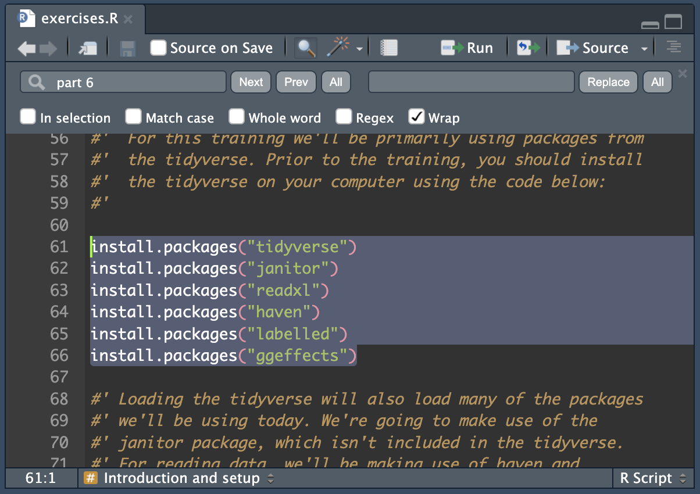

# Tidying and manipulating data using the `tidyverse`

#### Dr. Calum J. R. Webb, Sheffield Methods Institute, the University of Sheffield

**Link to slides [here](https://calumwebb.co.uk/teaching/pgrt/data-tidying/slides/)**

This repository contains the course materials for the one day training course *'Tidying and manipulating data using the `tidyverse`'*, for postgraduate research students and research professionals. These materials should be downloaded prior to the start of the course. Instructions are provided for computers running Windows, Mac, or Debian/Ubuntu systems. Other devices (iPhones, iPads, Android-based devices) are not suitable for the training course unless you also have access to an Rstudio server and can confidently configure an Rstudio server instance.

The course is designed to be 'hands-on' to ensure that you are able to apply skills you learn in a real research context.

If you are new to `R` and `Rstudio`, you will first need to install and configure the statistical programming language and the GUI on your device.

Completing all of the setting up steps for the course should take no longer than an hour. I have made my best effort to ensure that the instructions are as detailed as possible, but if you come across any problems, please do let me know.

## Installing R and Rstudio

If you have never used R or Rstudio before, the first thing you will need to do is install both the programming language (`R`) and the GUI (graphical user interface, `Rstudio`). I recommend following [this guide from R for Data Science](https://r4ds.hadley.nz/intro#prerequisites).

In short:

1)  First, go to <https://cloud.r-project.org>, download and install the latest version of `R` for your operating system. If you do not know your computer's operating system (Windows, Mac, etc.), and if you're a Mac user and do not know whether you have an Intel-based or an Apple Silicon based Mac, I recommend speaking to your University IT Helpdesk. For students at the University of Sheffield, IT services information can be [found here](https://www.sheffield.ac.uk/it-services).

2)  Next, go to <https://posit.co/download/rstudio-desktop/>, download and install the latest version of `Rstudio` for your operating system.

3)  Try opening `Rstudio`, **not R**, and see whether the screen you are greeted with looks like the one shown in [R for Data Science](https://r4ds.hadley.nz/intro#prerequisites).

## Downloading a copy of the repository

This repository contains all of the data and code we will be using in the exercises throughout the short course. You will need to download a copy of the repository in advance.

1)  At the top of this page (<https://github.com/cjrwebb/pgrt-tidying-data>), you should see a green button that says "Code" with a drop-down arrow. Click on the drop-down arrow, and then click "Download ZIP". You shouldn't need an account.

2)  Next, unzip the zip folder and open it in your file viewer. For Mac users, you can just click on the zip file and MacOS will automatically unzip it in your downloads folder. You can then open the unzipped folder. For Windows users, you may need to find the zip folder in your downloads folder, right click it, and then click "Extract all...", or use the unzip option on the ribbon menu. For Ubuntu/Debian, you should be able to right click the file and select "Extract here". Put the folder somewhere sensible in case you need to use it again in future.

3)  Double-click the `pgrt-tidying-data.Rproj` 'blue box' icon R project file to open the course R project in Rstudio.

4)  In the bottom right panel (by default), make sure you are on the "Files" tab, then open the `exercises.R` file by clicking on its name. This should open in the top left of your Rstudio window.

5) RStudio should prompt you to install any packages that are used in the `exercises.R` script if they are not already installed. Alternatively, you can scroll down to past the contents page and run all of the `install.packages()` code (highlight all lines and then press Ctrl + Enter or CMD + Enter, or click the "Run" button). You will need to be connected to the internet. If asked whether you want to compile any packages from source, type no and then press Enter. 

Once you have completed all of the steps above, you are ready for the course. You are welcome to explore the `exercises.R` script in advance of the training.

   
