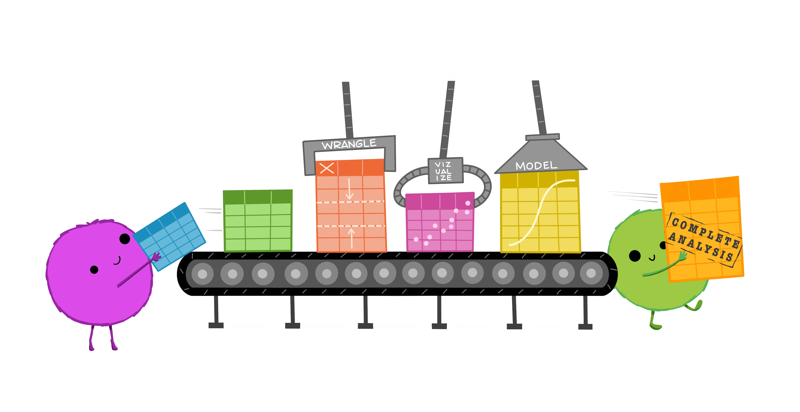

class: middle, title
background-size: contain


<!---- SLIDES SAVED TO PDF USING: 

decktape remark --load-pause 3200 "slides/intro-to-data-analysis-R.html" slides/intro-to-data-analysis.pdf 

using node.js

---->

<br><br>

# Tidying and manipulating data using the tidyverse

<br><br>

**Dr. Calum Webb**<br>
Sheffield Methods Institute, the University of Sheffield<br>
[c.j.webb@sheffield.ac.uk](mailto:c.j.webb@sheffield.ac.uk)

```{r setup, include=FALSE}
options(htmltools.dir.version = FALSE)

# These packages are required for creating the slides
# Many will need to be installed from Github
library(icons)
library(tidyverse)
library(xaringan)
library(xaringanExtra)
library(xaringanthemer)

# Defaults for code
knitr::opts_chunk$set(
  fig.width=9, fig.height=3.5, fig.retina=3,
  out.width = "100%",
  cache = FALSE,
  echo = TRUE,
  message = FALSE, 
  warning = FALSE,
  fig.show = TRUE,
  hiline = TRUE
)

# set global theme for ggplot to make background #F8F8F8F8 (off white),
# but otherwise keep all ggplot themes default (better for teaching)
theme_set(
  theme(plot.background = element_rect(fill = "#F8F8F8", colour = "#F8F8F8"), 
        panel.background = element_rect(fill = "#F8F8F8", colour = "#F8F8F8"),
        legend.background = element_rect(fill = "#F8F8F8", colour = "#F8F8F8")
        )
  )

```

```{r xaringan-tile-view, echo=FALSE}
# Use tile overview by hitting the o key when presenting
xaringanExtra::use_tile_view()
```

```{r xaringan-logo, echo=FALSE}
# Add logo to top right
xaringanExtra::use_logo(
  image_url = "header/smi-logo-white.png",
  exclude_class = c("inverse", "hide_logo"), 
  width = "180px", position = css_position(top = "1em", right = "2em")
)
```

```{r xaringan-themer, include=FALSE, warning=FALSE}

# Set some global objects containing the colours
# of the university's branding
primary_color <- "#131E29"
secondary_color <- "#440099"
tuos_blue <- "#9ADBE8"
white = "#F8F8F8"
tuos_yellow <- "#FCF281"
tuos_purple <- "#440099"
tuos_red <- "#E7004C"
tuos_midnight <- "#131E29"

# The bulk of the styling is handled by xaringanthemer
style_duo_accent(
  primary_color = "#131E29",
  secondary_color = "#440099",
  colors = c(tuos_purple = "#440099", 
             grey = "#131E2960", 
             tuos_blue ="#9ADBE8",
             tuos_mint = "#00CE7C"),
  header_font_google = xaringanthemer::google_font("Source Serif Pro", "600", "600i"),
  text_font_google   = xaringanthemer::google_font("Source Sans Pro", "300", "300i", "600", "600i"),
  code_font_google   = xaringanthemer::google_font("Lucida Console"),
  header_h1_font_size = "2rem",
  header_h2_font_size = "1.5rem", 
  header_h3_font_size = "1.25rem", 
  text_font_size = "0.9rem",
  code_font_size = "0.65rem", 
  code_inline_font_size = "0.85rem",
  inverse_text_color = "#9ADBE8", 
  background_color = "#F8F8F8", 
  text_color = "#131E29", 
  link_color = "#005A8F", 
  inverse_link_color = "#F8F8F8",
  text_slide_number_color = "#44009970",
  table_row_even_background_color = "transparent", 
  table_border_color = "#44009970",
  text_bold_font_weight = 600
)

```


```{r xaringan-panelset, echo=FALSE}
# Allow for adding panelsets (see example on slide 2)
xaringanExtra::use_panelset()
```

```{r xaringanExtra, echo = FALSE}
# Adds white progress bar to top
xaringanExtra::use_progress_bar(color = "#F8F8F8", location = "top")
```

```{r xaringan-extra-styles, echo = FALSE}
# Allow for code to be highlighted on hover
xaringanExtra::use_extra_styles(
  hover_code_line = TRUE,         #<<
  mute_unhighlighted_code = TRUE  #<<
)
```

```{r share-again, echo=FALSE}
# Add sharing links and other embedding tools
xaringanExtra::use_share_again()
```

```{r xaringanExtra-search, echo=FALSE}
# Add magnifying glass search function to bottom left for quick
# searching of slides
#xaringanExtra::use_search(show_icon = TRUE, auto_search = FALSE)
```


---

class: middle, inverse

## This training course is designed to be hands-on. We'll be spending most of our time working through real applications of the data tidying tools that make up the tidyverse.

---

class: middle, inverse

.pull-left[

<br><br>

# Data tidying requires the use of multiple tools

* The idea of today is to introduce you to all the tools that will allow you to tidy any untidy dataset.
* You won't be able to use all of them perfectly right from the start.
* But if you invest time into learning to use them, you can become very proficient in data tidying.


]

.pull-right[

.center[
```{r, echo = FALSE, out.width = "80%"}


```
]

]

---

class: middle, inverse

.pull-left[

<br><br>

# Why spend time learning how to tidy data?

* Tidying data and preparing it for analysis or visualisation is often the most time consuming part of any quantitative research project.
* Tidying data is not often reproducable *unless it has been tidied programatically*.

]

.pull-right[

.center[
```{r, echo = FALSE, out.width = "80%"}


```
]

]

---

class: middle, inverse

## Introduction: What is tidy data?


---

background-color: white

.center[
```{r, echo = FALSE, out.width = "80%"}

knitr::include_graphics("images/tidy-data-intro-1.jpg")

```
]

.footnote[
.right[Illustrations from the [Openscapes](https://www.openscapes.org/) blog [Tidy Data for reproducibility, efficiency, and collaboration](https://www.openscapes.org/blog/2020/10/12/tidy-data/) by Julia Lowndes and Allison Horst] 
]


---

background-color: white

.center[
```{r, echo = FALSE, out.width = "80%"}

knitr::include_graphics("images/tidy-data-intro-2.jpg")

```
]

.footnote[
.right[Illustrations from the [Openscapes](https://www.openscapes.org/) blog [Tidy Data for reproducibility, efficiency, and collaboration](https://www.openscapes.org/blog/2020/10/12/tidy-data/) by Julia Lowndes and Allison Horst] 
]

---

background-color: white

.center[
```{r, echo = FALSE, out.width = "80%"}

knitr::include_graphics("images/tidy-data-intro-3.jpg")

```
]

.footnote[
.right[Illustrations from the [Openscapes](https://www.openscapes.org/) blog [Tidy Data for reproducibility, efficiency, and collaboration](https://www.openscapes.org/blog/2020/10/12/tidy-data/) by Julia Lowndes and Allison Horst] 
]

---

background-color: white

.center[
```{r, echo = FALSE, out.width = "80%"}



```
]

.footnote[
.right[Illustrations from the [Openscapes](https://www.openscapes.org/) blog [Tidy Data for reproducibility, efficiency, and collaboration](https://www.openscapes.org/blog/2020/10/12/tidy-data/) by Julia Lowndes and Allison Horst] 
]


---

class: inverse, middle

## 1. Reading data from different data sources and select/rename columns.

* Reading data from Stata, SPSS, and Excel files
* Filtering variables using select()
* Generalised select()

---

background-color: white

<br> 

.center[
```{r, echo = FALSE, out.width = "80%"}


```
]


.footnote[
.right[[Artwork by @allison_horst](https://twitter.com/allison_horst)]

]

---

background-color: white

<br> 

.center[
```{r, echo = FALSE, out.width = "80%"}


```
]


.footnote[
.right[[Artwork by @allison_horst](https://twitter.com/allison_horst)]

]


---

class: inverse, middle

## 2. Creating new variables using mutate()

* Creating new variables that are transformations of existing variables
* Recoding categorical variables using case_when()
* Extracting numbers with parse_number()
* Performing repeated/generalised transformations


---

background-color: white

<br> 

.center[
```{r, echo = FALSE, out.width = "60%"}


```
]


.footnote[
.right[[Artwork by @allison_horst](https://twitter.com/allison_horst)]

]

---

background-color: white

<br> 

.center[
```{r, echo = FALSE, out.width = "80%"}


```
]


.footnote[
.right[[Artwork by @allison_horst](https://twitter.com/allison_horst)]

]

---

background-color: white

<br> 

.center[
```{r, echo = FALSE, out.width = "50%"}


```
]


.footnote[
.right[[Artwork by @allison_horst](https://twitter.com/allison_horst)]

]

---

class: inverse, middle

## 3. Aggregating data to higher levels with group_by()

* Creating new, aggregated datasets using group_by() and summarise()
* Adding group-level variables for multilevel models using group_by() and mutate()


---

background-color: white

.center[

<video width="100%" height="500" controls autoplay="true" loop="true">
<source src="images/3-grp-summarize-01.mp4" type="video/mp4">
</video>


]


.footnote[
.right[[Animation by Andrew Heiss](https://www.andrewheiss.com/blog/2024/04/04/group_by-summarize-ungroup-animations/)]

]


---

class: inverse, middle

## 4. Pivoting data between wide and long formats

* Converting wide datasets suitable for Latent Growth Structural Equation Modelling to long datasets suitable for multilevel modelling.
* ... and the reverse.


---

background-color: white

.center[
```{r, echo = FALSE, out.width = "40%"}

knitr::include_graphics("images/4-tidyr-pivoting.gif")

```
]


.footnote[
.right[[Animation by Garrick Aden-Buie](https://www.garrickadenbuie.com/project/tidyexplain/)]

]

---

background-color: white

<br>

.center[
```{r, echo = FALSE, out.width = "60%"}

knitr::include_graphics("images/4-pivot.png")

```
]


.footnote[
.right[[Animation by Garrick Aden-Buie](https://www.garrickadenbuie.com/project/tidyexplain/)]

]


---

class: inverse, middle

## 5. Working with strings and a little bit of regex

* How to remove certain characters or strings from character type variables (especially footnotes).
* Extracting subsets of characters from longer strings.
* Splitting variables into multiple columns based on a character within a string.

---

background-color: white

<br> 

.center[
```{r, echo = FALSE, out.width = "60%"}

knitr::include_graphics("images/5-stringr.png")

```
]


.footnote[
.right[[Artwork by @allison_horst](https://twitter.com/allison_horst)]

]

---

background-color: white

<br> 

.center[
```{r, echo = FALSE, out.width = "80%"}


```
]


.footnote[
.right[[Artwork by @allison_horst](https://twitter.com/allison_horst)]

]


---

class: inverse, middle

## 6. Joining relational datasets

* Joining datasets based on a shared key
* Joining datasets together based on a combination of variables that form a key
* Joining higher level data to lower level data
* Checking for missing observations with anti_join()

Key: A value, usually a string, that uniquely identifies each observation across multiple related (relational) datasets

---

background-color: white

<br>

.center[
```{r, echo = FALSE, out.width = "60%"}

knitr::include_graphics("images/6-left-join.gif")

```
]


.footnote[
.right[[Animation by Garrick Aden-Buie](https://www.garrickadenbuie.com/project/tidyexplain/)]

]

---

background-color: white

<br>

.center[
```{r, echo = FALSE, out.width = "60%"}


```
]


.footnote[
.right[[Diagram from R for Data Science 2e](https://r4ds.hadley.nz)]

]

---

class: inverse, middle

## 7. Working with dates

* How to fix how R interprets dates when they aren't in YYYY-MM-DD format.

---

background-color: white

<br> 

.center[
```{r, echo = FALSE, out.width = "70%"}


```
]


.footnote[
.right[[Artwork by @allison_horst](https://twitter.com/allison_horst)]

]

---

class: inverse, middle

## 8. Filtering rows of observations

* How to filter data based on values in character/factor type variables
* How to filter data based on numeric type variables
* How to filter data based on dates

---

background-color: white

<br> 

.center[
```{r, echo = FALSE, out.width = "80%"}

knitr::include_graphics("images/8-filter.png")

```
]


.footnote[
.right[[Artwork by @allison_horst](https://twitter.com/allison_horst)]

]

---

class: middle, inverse

.pull-left[

<br><br>

# You now have all the tools — all that's left is the practice.

* In this course I've tried to give you, in as short a time as possible, information and practical examples of how to use all of the tools I've picked up over more than 10 years of using R.


]

.pull-right[

.center[
```{r, echo = FALSE, out.width = "80%"}


```
]

]

---

class: middle, inverse

.pull-left[

<br><br>

# You now have all the tools — all that's left is the practice.

* If you keep practicing tidying untidy datasets, using these tools will eventually become effortless. Untidy data becomes a puzzle to solve. But when you're just starting out, the puzzles will be frustrating.


]

.pull-right[

.center[
```{r, echo = FALSE, out.width = "80%"}


```
]

]

---

background-color: white

<br> 

.center[
```{r, echo = FALSE, out.width = "100%"}


```
]


.footnote[
.right[[Artwork by @allison_horst](https://twitter.com/allison_horst)]

]


